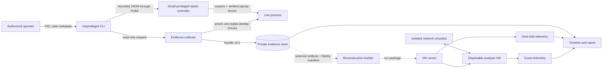
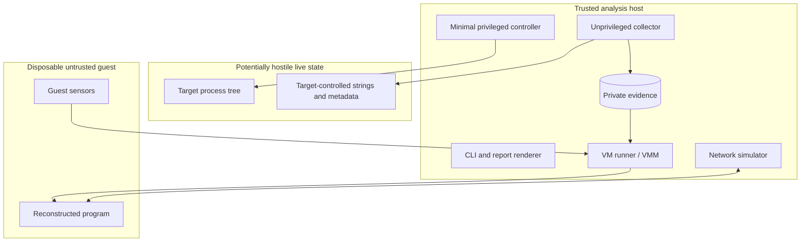
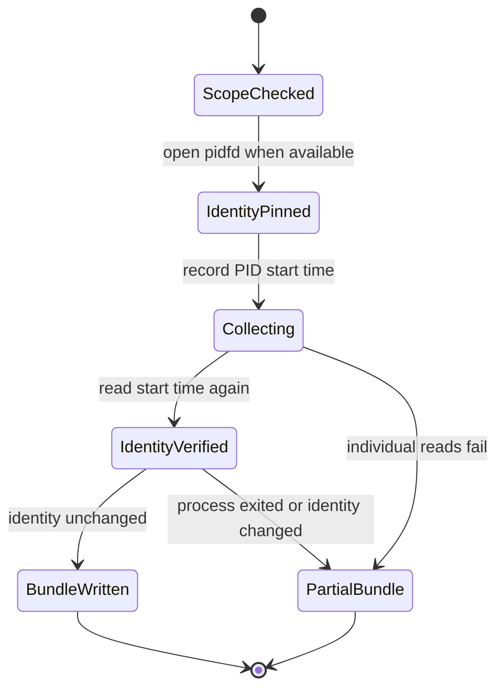
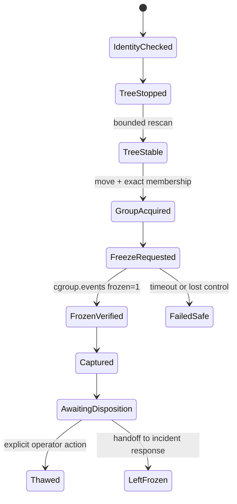
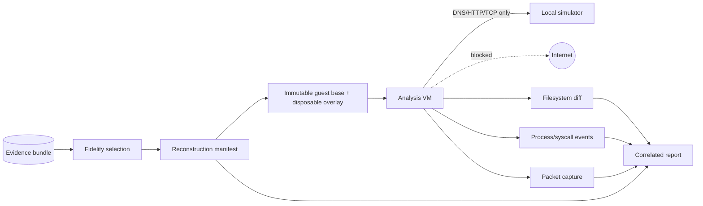

# Operating architecture

## Product boundary

Process Stasis is three related workflows, not one transparent migration trick:

1. **Inspect** reads evidence from an authorized live process without changing its
   execution state.
2. **Stasis** explicitly freezes a controlled process group, verifies the freeze,
   and captures evidence without silently resuming it.
3. **Replay** builds a declared reconstruction and starts it inside a disposable
   analysis VM. Replay is not represented as continuation of the original process.

Inspect and the evidence/case workflow are implemented. Stasis can create a
managed cgroup for a new command or acquire a visible existing tree through a
bounded stop/rescan/move transaction before verified freeze. Replay remains
disabled until its VM and network boundary exist.

## End-to-end data flow

The inspect/evidence and controller arrows are implemented. VM/replay arrows
remain later phases.

## Trust boundaries

Anything read from `/proc`, copied from the target, or exported from the guest is
hostile input. Parsers must be bounded and must not execute, import, render as HTML,
or follow paths supplied by that input. The later privileged controller must not
parse evidence or build reports.

## Inspect workflow

Inspect never sends a signal, changes a cgroup, opens process memory for writing, or
copies arbitrary file contents. Individual collection failures become structured
errors. A target that exits during capture produces a partial result rather than a
false complete result. Read-only does not mean zero observer effect: procfs reads,
executable hashing, page-cache activity, audit records, and filesystem access-time
policy can still leave traces.

## Stasis workflow

Stasis is intentionally a separate, explicit command because it changes system
state.

The current controller rejects PID 1 and the desktop's own process tree, checks
start-time identity before moving each PID, limits discovery to 4,096 members and
twelve stabilization rounds, and rolls partial acquisition back to recorded
original cgroups. It verifies `cgroup.events` after freeze and resume. Managed
launch creates the cgroup before the child execs and drops back to the requesting
desktop user's credentials.

## Replay workflow and network boundary

The VM receives no host directories, user credentials, clipboard, USB/GPU devices,
container-engine socket, or unrestricted management channel. Export occurs only
after execution stops, through a bounded artifact path controlled by the runner.

## Evidence lifecycle

1. A case directory is created with owner-only permissions.
2. The collector writes a temporary manifest in that directory.
3. After collection and identity verification, the file is flushed and atomically
   renamed to `manifest.json`.
4. The manifest records capture start/end times, completeness, errors, and hashes.
5. Raw bundles stay under `work/private/` or an operator-selected protected path.
6. A separate later command creates a sanitized report; raw strings are never
   assumed safe to publish.

## Failure rules

- Missing permissions produce a partial bundle, never fabricated empty fields.
- PID exit or identity mismatch marks the capture incomplete.
- Unsupported kernel controls disable the corresponding action.
- A failed or unverified freeze never transitions to `frozen`.
- Replay never receives Internet access as a compatibility fallback.
- A simulator failure stops or isolates replay; it does not route around it.
- No component automatically kills or labels the target malicious.

## Component ownership

| Component | Privilege | Responsibility | Must not do |
|---|---:|---|---|
| CLI | User | Validate operator input and select an explicit workflow | Infer authorization or hide warnings |
| Collector | User by default | Read and normalize bounded process evidence | Signal, attach for writing, or execute target data |
| Stasis controller | Narrow elevated helper | Launch/acquire a tree, create/control cgroup, and verify state | Parse reports, access network, terminate a target, or render UI |
| Evidence store | Owner-only | Preserve versioned raw bundles and integrity metadata | Serve unescaped data to a browser |
| Builder | User | Select artifacts and record reconstruction fidelity | Claim a fresh launch is continuation |
| VM runner | Elevated only where required | Enforce guest, resource, and network boundaries | Mount home directories or silently enable egress |
| Simulator | Isolated service account/guest | Return deterministic fake network responses | Relay to real destinations |
| Correlator | User | Normalize telemetry and report uncertainty | Make an automatic malware verdict |
