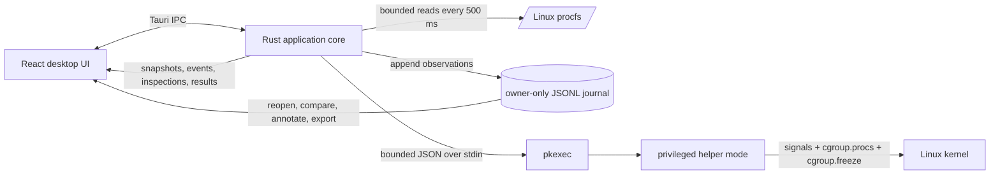
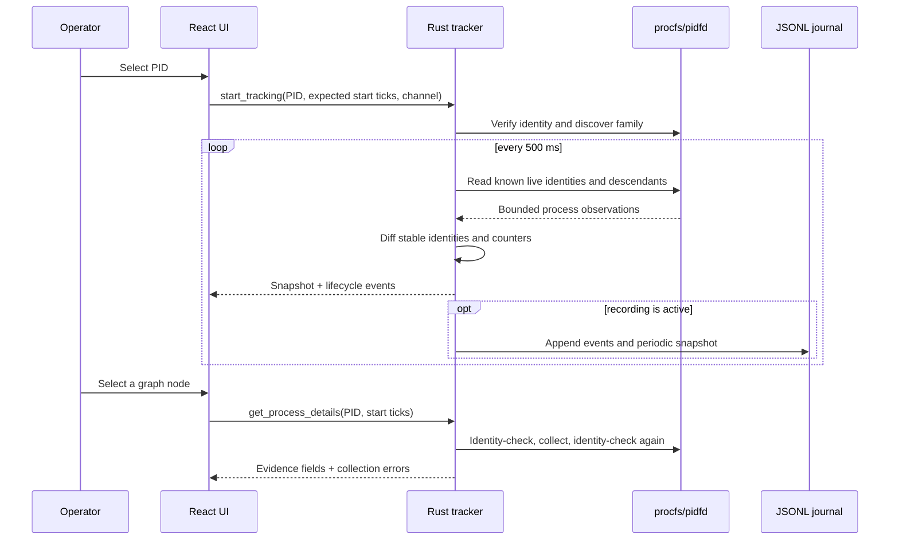
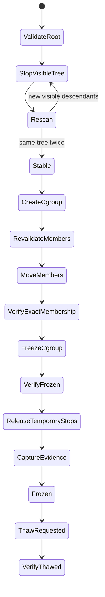

# Process Stasis technical overview

This is the canonical technical introduction to the implemented Process Stasis
`0.8.0` desktop application. It explains what runs, where data comes from, how a
PID becomes a retained process-family model, how freeze and resume work, where
privilege begins and ends, how evidence is stored, and which capabilities do not
exist yet.

For the exhaustive field-level evidence contract, continue to
[`DESKTOP-WORKFLOW.md`](DESKTOP-WORKFLOW.md). For design decisions and their
reasons, see [`DECISIONS.md`](DECISIONS.md).

## The working model in one page

Process Stasis is a Linux desktop observer with an optional cgroup control path:



The UI and normal collector run as the logged-in desktop user. Reading process
metadata, building the graph, recording sessions, rendering reports, and showing
the interface do not require root. Only the small helper mode is elevated, and
only when launching a managed command or changing cgroup state.

The product currently has three usable paths:

1. **Observe:** select one visible process identity and continuously reconstruct
   its visible descendants and lifecycle changes.
2. **Investigate:** inspect nodes, record observations, reopen sessions, search
   and annotate the timeline, compare snapshots, and export JSON or HTML.
3. **Control:** acquire an already-running visible tree into a cgroup and freeze
   or resume it, or launch a command inside a managed cgroup from birth.

“Reconstruct” here means a temporal model inferred from repeated observations.
It is not a kernel audit log and cannot contain an event that began and ended
entirely between samples.

## Technology stack

| Layer | Technology | Role in the application |
|---|---|---|
| Desktop shell | Tauri 2 | Creates the Linux desktop window, exposes typed commands to the WebView, provides native dialogs, and builds Debian/AppImage packages. |
| Native core | Rust 2021 | Procfs collection, identity checking, tracking, journaling, export writes, helper invocation, cgroup control, and native tests. |
| Async/runtime | Tokio + Tauri runtime | Runs the tracker loop and moves blocking collection/control work away from the UI thread. |
| Serialization | Serde + `serde_json` | Defines IPC payloads, JSONL evidence records, helper requests/responses, and exports. |
| Identity/integrity | Linux pidfds, boot ID, procfs start ticks, SHA-256, UUIDs | Distinguishes process instances from reused PID numbers and identifies sessions and executable content. |
| Frontend | React 19 + TypeScript | Investigator workspace, state transitions, filtering, inspection, case management, and export composition. |
| Build frontend | Vite 8 | Development server and production WebView bundle. |
| Process graph | `@xyflow/react` | Interactive retained lineage graph, node selection, viewport control, and branch folding. |
| Time-series charts | uPlot | CPU, memory, I/O, descriptor, and thread telemetry. |
| Motion | Anime.js | Scoped entry and interface transitions; live samples do not remount the whole graph. |
| Large-list rendering | TanStack Virtual | Keeps long evidence and event collections responsive. |
| Icons/fonts | Phosphor Icons, bundled Manrope and JetBrains Mono | Interface vocabulary and reproducible typography without a web-font dependency. |
| Privilege boundary | Polkit `pkexec` | Starts only the helper entry point with elevated rights when cgroup mutation is requested. |
| Containment primitive | Linux cgroup v2 freezer | Holds every current member of the managed group and automatically includes later descendants. |
| Legacy collector | Python standard library | Preserves the earlier `0.1` single-PID snapshot workflow; it is not the desktop runtime. |
| Verification | Rust tests, pytest, TypeScript, Vitest, browser checks | Covers collection, evidence, control primitives, frontend contracts, and built layouts. |

The desktop frontend does not call procfs or cgroup files directly. All host
interaction passes through Tauri commands implemented in Rust.

## Source and component map

```text
src-ui/
  App.tsx                         application state and workspace routing
  api.ts                         Tauri IPC adapter and browser-preview adapter
  types.ts                       frontend view of native contracts
  components/ProcessPicker.tsx   process/session selection and managed launch
  components/ProcessGraph.tsx    retained family graph
  components/Inspector.tsx       deep per-process evidence
  components/ContainmentPanel.tsx freeze/resume control surface
  components/EventStream.tsx     current lifecycle stream
  components/InvestigationTimeline.tsx recorded search/annotation workflow
  components/MetricChart.tsx     uPlot telemetry

src-tauri/src/
  lib.rs              Tauri commands and application composition
  types.rs            shared native data contracts
  procfs.rs           bounded procfs parsing and deep inspection
  tracker.rs          session ownership, sampling, lineage, events, and recording
  case_store.rs       JSONL journals, metadata sidecars, reopen and integrity rules
  containment.rs      helper protocol, cgroup transaction, launch, freeze and thaw
  main.rs             selects helper mode before starting the desktop runtime

packaging/
  io.process-stasis.desktop.policy   installed Polkit action for the Debian package

src/process_stasis/
  ...                 legacy Python `0.1` one-PID collector
```

## Process identity and observation scope

A PID alone is not treated as an identity because Linux can reuse it. The stable
identity used by the tracker combines:

```text
host boot ID + PID + /proc/PID/stat start-time ticks
```

The backend also opens a pidfd when the kernel and permissions allow it. The
start-time comparison prevents a newly reused PID from being mistaken for the
selected process; the pidfd gives a stable reference for observing exit.

When an operator attaches to a process:

1. The picker reads visible numeric `/proc` directories.
2. Rust checks that the chosen PID still has the expected start-time ticks.
3. The tracker records visible ancestors as context.
4. Only the focus identity and known living descendants may introduce new child
   nodes. Ancestors cannot introduce unrelated siblings.
5. Every 500 ms the tracker rescans known living family members, updates their
   resource counters, discovers visible children, and checks retained pidfds.
6. A newly visible stable child produces an inferred spawn event. A changed task
   name or executable link produces an inferred exec event. A missing identity,
   supported by pidfd state where available, produces an exit event.
7. Exited nodes stay in the graph, and known descendants continue to be followed
   after the original focus process exits.

This creates a retained temporal family rather than repeatedly displaying the
current `ps` tree.

## Observation and UI data flow



React receives tracking messages over a Tauri channel rather than polling IPC
for every sample. The current graph, metrics, events, selected node, recording
state, and containment state are different views over the same session identity.

Graph coordinates are UI state, not evidence. Existing node positions and the
operator's viewport survive new samples. Only newly discovered nodes receive an
entry animation. Pausing the graph pauses presentation; native collection keeps
running.

## Deep inspection

Deep inspection is an explicit, identity-checked read of one live node. It
collects bounded data from `/proc/PID`, including:

- arguments, selected status and security fields;
- executable, working directory, process root, executable metadata and SHA-256;
- namespace identifiers and observer-relative namespace differences;
- environment keys and values, with values hidden in the normal UI and redacted
  from default exports;
- memory maps, I/O counters, resource limits and cgroup membership;
- descriptor links plus bounded fdinfo;
- socket endpoints resolved by correlating descriptor socket inodes with the
  target network namespace's proc tables.

The backend reads the stable identity before and after collection. If the target
exits, changes identity, denies access, or a field races, the result carries an
error or partial state instead of inventing an empty successful value.

## Evidence persistence

Recording creates two owner-only files in the Tauri application-data directory:

```text
recordings/SESSION_UUID.jsonl       append-only observations, mode 0600
recordings/SESSION_UUID.case.json   replaceable analyst metadata, mode 0600
```

The directory is mode `0700`. The journal can contain its versioned header,
lifecycle events, periodic graph snapshots, pause/resume/end markers, deep
inspections, containment requests, and verified control results. It is capped at
32 MiB and opened without following symlinks.

Notes, tags, titles, summaries, and bookmarks live in the sidecar so analyst
interpretation never rewrites original observations. On reopening, the backend
checks the canonical session UUID, parses the bounded journal, tolerates only one
trailing partial JSONL line, and reports the journal SHA-256.

Exports are separate artifacts:

- `process-stasis/session-v0.8` JSON contains case data, collector profile,
  target identity, snapshots, events, inspections, control actions and known
  limitations.
- HTML is a bounded escaped report rather than executable target content.
- Normal exports redact environment values. Full environment export is a
  separate explicit operation.
- Native export writes are atomic, owner-only, and limited to 64 MiB.

## Privilege boundary and helper protocol

The desktop application is not run as root. When control is requested, the Rust
backend starts the current executable through `pkexec` with the hidden
`--process-stasis-helper` entry point. A bounded JSON request is written to the
helper's standard input; a bounded JSON result is read from standard output.

The helper accepts only these operations:

- launch a command in a newly created managed group;
- acquire and freeze the current visible family;
- freeze an already managed group;
- thaw an already managed group.

It does not render UI, parse evidence reports, inspect arbitrary filesystem
paths, access the network, or decide whether a process is malicious. Session
names must be canonical UUIDs. Process identities are verified again after
elevation rather than trusting the unprivileged snapshot.

## Acquiring and freezing an existing tree

An already-running family may fork while it is being discovered. Process Stasis
therefore uses a bounded stop, rescan, migrate and verify transaction:



The exact implemented transaction is:

1. Start the session journal automatically if it is not already recording.
2. Reject PID 1 and the Process Stasis application's own process family.
3. Verify the focus PID and start-time ticks.
4. Discover the current visible descendants, up to 4,096 members.
5. Send `SIGSTOP` only to members that were not already stopped.
6. Rescan for children and require the same complete tree twice, within twelve
   bounded rounds.
7. Create `/sys/fs/cgroup/process-stasis/SESSION_UUID`.
8. Revalidate each stable process identity and record its original cgroup.
9. Move the processes through `cgroup.procs` and require exact membership.
10. Write `1` to `cgroup.freeze` and poll `cgroup.events` until the kernel reports
    `frozen 1`.
11. Send `SIGCONT` only to members temporarily stopped by Process Stasis. They do
    not execute because the cgroup freezer remains active.
12. Record the result and capture bounded deep inspections for up to 256 managed
    members while execution is held.

If acquisition fails, the helper thaws the temporary group, moves migrated
members back to their recorded original cgroups, resumes only processes it
stopped, and removes the empty group. A successful Resume writes `0` to
`cgroup.freeze` and waits for `cgroup.events` to report `frozen 0`.

After a successful acquisition, the family remains in the managed cgroup after
resume. New descendants inherit that membership, so later freeze operations do
not need to reacquire the family.

## Launching under Stasis

Managed launch avoids the discovery gap at the beginning of a process lifetime:

1. The helper creates the session cgroup before starting the command.
2. It forks a child and moves that child into the group before `exec`.
3. The child initializes the requesting user's supplementary groups and drops to
   that user's UID and GID.
4. It executes the supplied command through a minimal `/bin/sh -lc "exec ..."`
   wrapper with redirected standard streams.
5. The backend returns the launched process only after it can identify the final
   executable image.

The first process and all descendants are therefore born inside the managed
group. This is stronger than retroactively acquiring an existing tree, but it is
still cgroup containment rather than syscall emulation or a virtual machine.

## Packaging and runtime model

Tauri produces two Linux x86-64 packages under
`src-tauri/target/release/bundle/`:

- The Debian package is the preferred distribution. It declares `pkexec` and
  GStreamer base plugins and installs the Process Stasis Polkit policy.
- The AppImage bundles most application libraries and the media framework, but
  compatibility still depends on the glibc/kernel baseline of the build.

The WebView has a restrictive content-security policy. It loads the compiled
frontend and bundled fonts locally; it is not a hosted web application and does
not need an Internet service to inspect processes.

Development uses:

```bash
npm install
npm run dev                 # Tauri desktop application
npm run dev:web             # synthetic browser-only UI preview
npm run typecheck
npm run build:web
cargo test --manifest-path src-tauri/Cargo.toml
pytest -q                   # legacy collector tests
npm run tauri build         # .deb and .AppImage
```

The browser preview never inspects host processes and never exercises the real
privileged helper. Native containment validation must be performed against the
repository's benign synthetic target on an authorized Linux host.

## What the system does not currently do

- It does not install eBPF, audit, or process-connector lifecycle telemetry.
- It can miss activity that appears and exits inside a 500 ms sampling gap.
- Existing-tree acquisition cannot recover children that exited before any scan
  observed them; managed launch contains only future execution from birth.
- It does not capture process memory, syscall arguments, library calls, packets,
  DNS payloads, or file contents.
- It does not apply a network policy, terminate a target, release a successfully
  acquired tree back to its former cgroups, or checkpoint it.
- It does not move a running process into a VM, emulate libc/syscalls, restore
  through CRIU, or provide replay. Those need separate isolation and fidelity
  designs.
- It does not produce an automatic malicious/benign verdict.

In short: `0.8.0` provides a useful live process-family observer, investigation
journal, and verified cgroup freeze/resume mechanism. It is not yet a malware
sandbox or execution-replay platform.

## Where to read next

| Document | Purpose |
|---|---|
| [`DESKTOP-WORKFLOW.md`](DESKTOP-WORKFLOW.md) | Exact observed fields, sampling behavior, journal and export contracts. |
| [`ARCHITECTURE.md`](ARCHITECTURE.md) | Long-term Inspect/Stasis/Replay boundaries and trust model. |
| [`DECISIONS.md`](DECISIONS.md) | Architecture decisions and their reasons. |
| [`UI-DIRECTION.md`](UI-DIRECTION.md) | Visual language and interaction rules. |
| [`CURRENT-WORKFLOW.md`](CURRENT-WORKFLOW.md) | Historical Python `0.1` single-PID collector only. |
| [`ROADMAP.md`](ROADMAP.md) | Implemented milestones and future work. |
